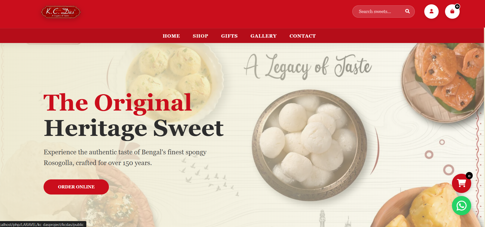
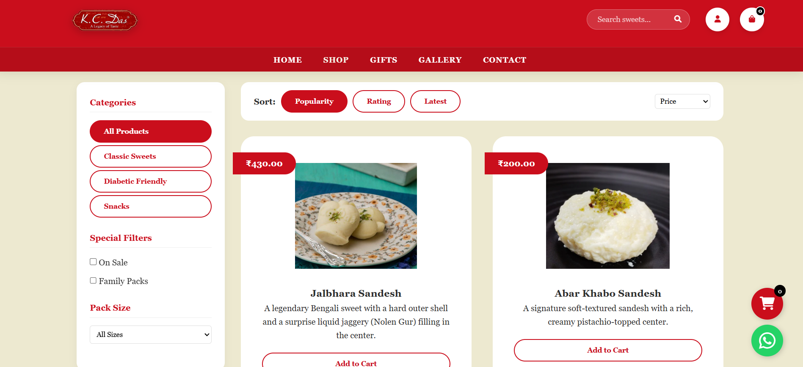
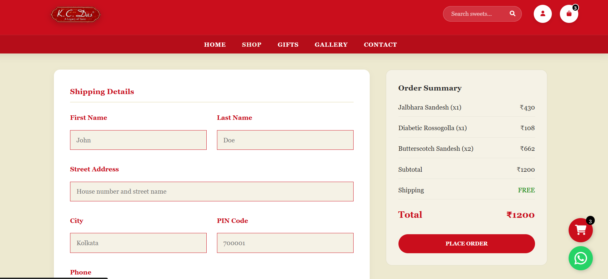
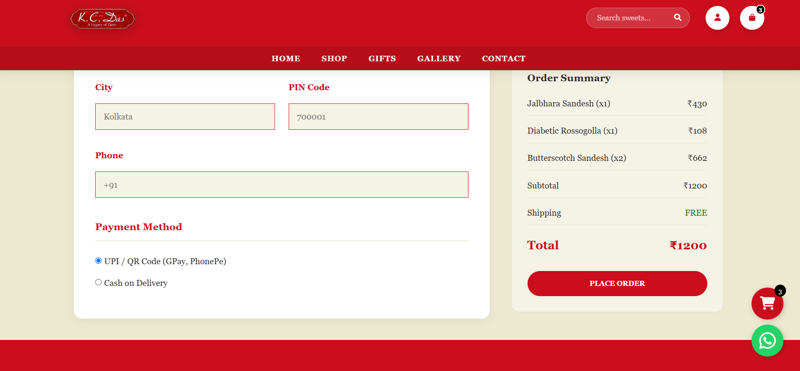
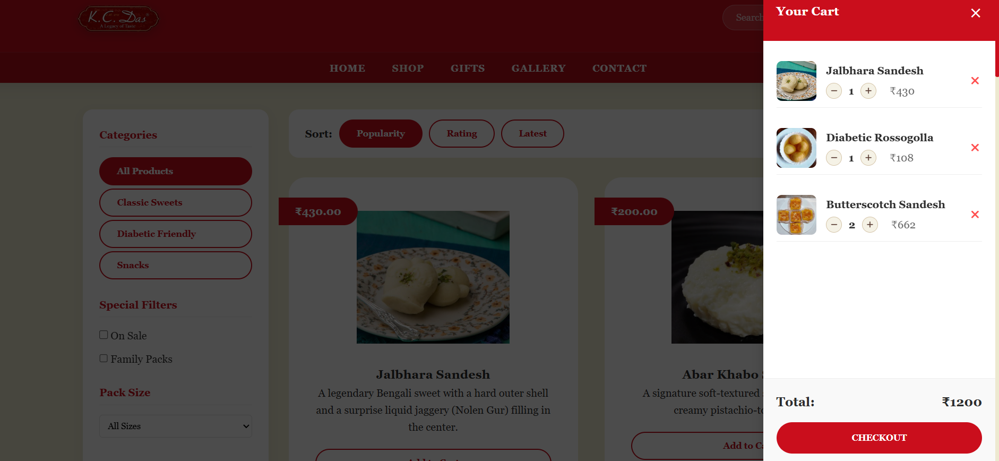

# KC Das

KC Das is a web-based e-commerce application designed to provide customers with a convenient way to browse products, view product details, manage their cart, and place orders online.


## 📸 Screenshots

### Home Page




### Shop Page




###  Checkout



###  Checkout



###  Cart



###  Login


## ✨ Features

* User registration and login
* Product browsing
* Product details
* Shopping cart
* Checkout
* Order placement
* Order confirmation
* Customer account
* Responsive user interface

## 🛠️ Technologies Used

* PHP
* Laravel
* MySQL
* Blade
* HTML5
* CSS3
* JavaScript

## ⚙️ Installation

### 1. Clone the repository

```bash
git clone https://github.com/Soumya-jeet813/Kc-Das.git
```

### 2. Navigate to the project

```bash
cd Kc-Das
```

### 3. Install PHP dependencies

```bash
composer install
```

### 4. Create the environment file

```bash
cp .env.example .env
```

For Windows PowerShell, you can use:

```powershell
Copy-Item .env.example .env
```

### 5. Generate the application key

```bash
php artisan key:generate
```

### 6. Configure the database

Create a MySQL database and update the database settings in your `.env` file.

### 7. Run migrations

```bash
php artisan migrate
```

### 8. Start the Laravel development server

```bash
php artisan serve
```

The application will normally be available at:

```text
http://127.0.0.1:8000
```

## 📁 Project Structure

```text
app/          → Application logic
database/     → Migrations and database files
public/       → Public assets
resources/    → Views and frontend resources
routes/       → Application routes
screenshots/  → Project screenshots
```

## 👩‍💻 Author

**Soumya Jeet**

Web Developer

## 📄 License

This project is for portfolio and demonstration purposes.
